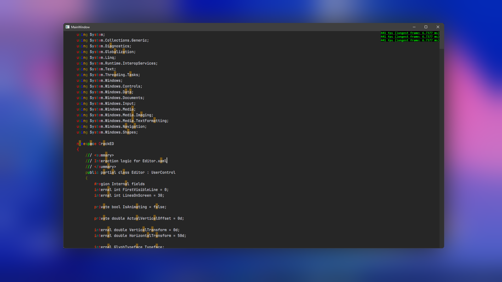

# CrackED
A performance-oriented text/code editor component for WPF.

## Out of the box features
- Smooth scrolling (can be turned off)
- Retained or immediate mode rendering
- Search keyword higlighting with the `EditorInstance.SerachForAll("keyword");` function
- Text styling (beta) with the `EditorInstance.AddStyleSpan(line: 12, new StyleSpan(start: 0, lenght: 10, foreground: Brushes.Orange));` function

## Other goals and features
- The codebase is relatively simple
- Lightweight
